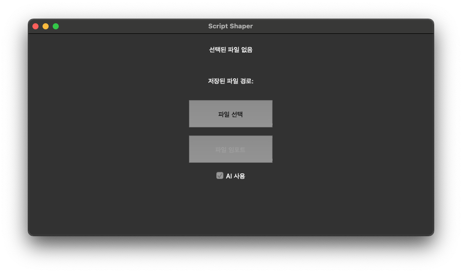

# script-shaper

ScriptShaper : 자막제작자를 위한 대본 변환 프로젝트

## 프로젝트 설명

- 프로젝트 목적 : 자막제작자를 위한 대본 변환 프로젝트
- 프로젝트 기능 :
  - 파일 읽기 : Word, Excel, CSV, PDF, HWP 파일을 읽어서 텍스트로 변환
  - 텍스트 전처리 : 텍스트에서 화자명과 대사를 추출
  - Word 파일로 저장 : 데이터프레임을 Word 파일로 저장
  - ai 를 사용한 텍스트 기능

## 프로그램 사용 방법

1. 프로그램 다운로드 밎 실행

- 해당 프로그램은 macOS 환경에서 작동합니다.
- 프로그램 다운로드 : https://github.com/sora9z/script-shaper/releases
  - script-shaper 다운로드
- 다운로드 받은 실행 파일 실행
  - 권한을 변경해야 합니다 terminal을 열고 다운로드 받은 파일 위치로 이동 후 다음 명령어 입력
    ```bash
    chmod +x script-shaper
    ```
  - 처음 실행시 mac os 보안 설정에서 허용을 해야합니다.
    - 시스템 환경설정 > 보안 및 개인정보 보호 > 보안 탭에서 허용
  - 프로그램 실행 시간이 조금 걸릴 수 있으니 조금만 기다려주세요.

2. 프로그램 사용법



- 파일 읽기 : `파일 선택` 버튼을 통해 파일 선택
- AI 사용 여부 체크

  - AI 사용시 시간이 다소 소요될 수 있습니다.
  - AI 사용시 Download 폴더에 settings.json 파일 안에 openai api key 를 입력해야 합니다.

    ```json
    {
      "openai_api_key": "your_openai_api_key"
    }
    ```

    - 만약 없다면 import시 key 입력 창이 뜹니다.
    - 입력을 하면 Downloads 폴더에 settings.json파일이 함께 생성됩니다.

- 파일 임포트 : `파일 임포트` 버튼을 통해 파일 임포트
- 저장 위치는 Downloads 폴더에 저장됩니다.

## 대사 인식 조건

프로그램이 텍스트를 대사로 인식하는 조건들입니다:

### 1. 화자명 패턴
- `화자명: 대사` 형태 (콜론 포함)
- `화자명    대사` 형태 (공백 3개 이상)

### 2. 문장부호로 끝나는 경우
- `!`, `?`, `…`, `...`, `~`, `,`, `;`, `"` 로 끝나는 문장

### 3. 한국어 구어체 어미로 끝나는 경우

**두 글자 이상 어미 (우선순위)**:
- 존댓말: `요`, `죠`, `네요`, `군요`, `합니다`, `드립니다`, `습니까`, `세요` 등
- 반말: `구나`, `구나요`, `했어`, `할게`, `할까`, `거든요`, `잖아`, `잖아요` 등  
- 사투리: `구들`, `구먼`, `구먼요` 등
- 기타: `없어`, `있어`, `그래어`, `뭐어` 등

**한 글자 어미 (2글자 이상 텍스트에서만)**:
- `다`, `라`, `냐`, `니`, `네`, `해`, `지`, `자`, `마`, `봐`, `세`, `셔`, `야`, `여`, `오`, `와`, `워`, `게`, `구`, `어`

### 4. 문장 중간에 구어체 패턴이 있는 경우
- 문장 어느 위치든 위의 두 글자 이상 구어체 어미가 포함된 경우
- 예: `아일 낳구 키우면서 더 용서가 안 되는 거야` → `거야` 포함으로 대사 인식

### 5. 전처리 과정
- 괄호/대괄호/중괄호 안의 지시어는 제거 후 판별: `(윤재가 당기는)`, `[효과음]`, `{주석}` 등
- 마침표(`.`)는 제외하고 어미 확인: `안녕하세요.` → `안녕하세요`로 `요` 어미 확인
