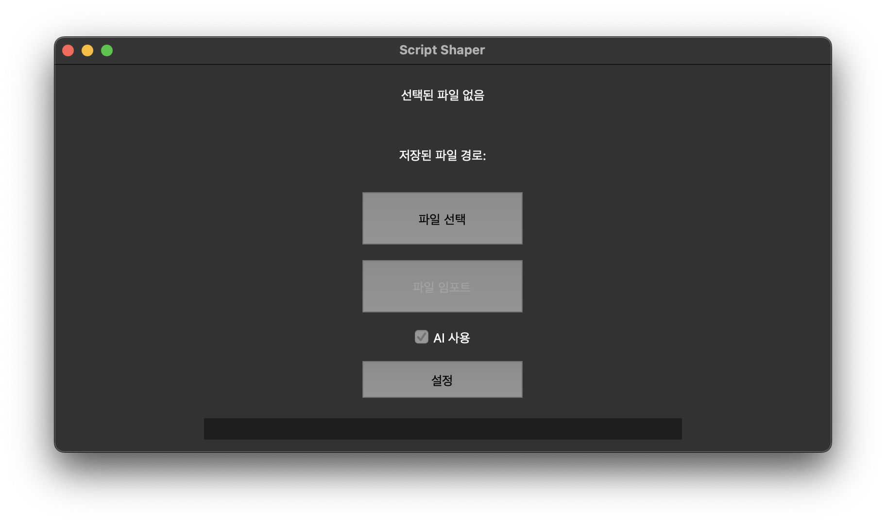

# ScriptShaper

자막 제작자를 위한 대본 변환 도구 — 대본 문서에서 **대사만** 추출해 자막 작업용 Word 파일로 저장합니다.

## 무엇을 하나요

대본(.docx)을 넣으면:

1. **대사만 남깁니다** — 화자명, 지문(행동·장면 묘사), 씬 헤더를 제거
2. **자막 스타일로 정리합니다** — `?` `!` `…` `,` 등 기호 제거, 괄호 지시어 제거, 각 줄 끝에 마침표 하나
3. **(AI 사용 시) 20자 이내 줄로 재구성** 후 Word(.docx)로 저장

```
원본:  수미/경진(E)	생일 축하 합니다! 생일 축하 합니다!
결과:  생일 축하 합니다 생일 축하 합니다.
```

### AI 추출 방식 (기본, 권장)

OpenAI(gpt-5.4) 사용

### 지원 형식

| 형식                                 | 지원                              |
| ------------------------------------ | --------------------------------- |
| `.docx` (Word)                       | ✅                                |
| `.xlsx` (Excel — 셀당 대사 1줄 형태) | ✅ (분류 없이 화자명·기호만 정리) |
| `.doc` `.pdf` `.hwp` `.csv` `.txt`   | ❌ 미지원 (docx로 변환 후 사용)   |

## 설치 및 실행 (macOS)

1. [Releases](https://github.com/sora9z/script-shaper/releases)에서 `ScriptShaper-mac.zip` 다운로드
2. 더블클릭으로 압축 해제 → `ScriptShaper.app`
3. **최초 1회만**: 앱을 우클릭(또는 Ctrl+클릭) → `열기` → `열기` 확인
   (서명되지 않은 앱이라 처음 한 번은 확인이 필요합니다. 이후에는 그냥 더블클릭으로 실행)

터미널 작업(chmod 등)은 필요 없습니다. 오류 발생 시 앱 옆에 생기는 `log/날짜.log` 파일을 확인하세요.

## 사용법



1. **설정** (최초 1회) — `설정` 버튼에서:
   - **OpenAI API 키** 등록 (AI 사용에 필요, Cmd+V 붙여넣기 지원)
   - **기본 저장 경로** 지정 (미설정 시 `~/Downloads`)
2. **파일 선택** — 변환할 대본(.docx) 선택
3. **AI 사용** — 기본으로 켜져 있습니다. 끄면 규칙 기반 추출(아래 "대사 인식 조건")로 동작
4. **파일 임포트** — 변환 실행. 완료되면 `<원본이름>_converted.docx`가 저장 경로에 생성됩니다

참고:

- AI 사용 시 문서 길이에 따라 수십 초가량 걸릴 수 있습니다
- AI가 켜져 있는데 키가 없으면 변환 전에 안내 에러가 뜹니다 → `설정`에서 키 등록
- 설정 파일 위치: `~/Library/Application Support/ScriptShaper/settings.json` (구버전 `~/Downloads/settings.json`의 키는 자동 이관)
- 문제 발생 시 로그 확인: 실행파일 옆 `log/YYYY-MM-DD.log` (에러 traceback 포함)

## 로컬 실행 / CLI (개발·디버그)

GUI 없이 변환할 수 있습니다:

```bash
pipenv install        # 의존성 설치 (Python 3.11)

pipenv run python convert_cli.py "경로/대본.docx"                     # 규칙 기반 추출
pipenv run python convert_cli.py "경로/대본.docx" --ai                # AI 분류 추출
pipenv run python convert_cli.py "경로/대본.docx" --ai --split        # AI 추출 + 20자 분할
pipenv run python convert_cli.py "경로/대본.docx" --ai --out 결과폴더  # 저장 폴더 지정
```

- API 키: `~/Library/Application Support/ScriptShaper/settings.json` 또는 `OPENAI_API_KEY` 환경변수(.env 지원)
- GUI 실행: `pipenv run python main.py`
- 테스트: `pipenv run python -m pytest`
- 로컬 빌드: `pipenv run pyinstaller main.spec` (배포는 main 푸시 시 CI가 자동 빌드·릴리스)

## 대사 인식 조건 (AI 미사용 시)

> **AI 사용 시에는 아래 규칙 대신** 모델이 각 줄을 대사/지문/씬헤더로 분류해 추출합니다. 아래 규칙은 AI를 끈 경우(폴백)에만 적용됩니다.

### 1. 화자명 패턴

- `화자명: 대사` 형태 (콜론 포함)
- `화자명    대사` 형태 (공백 3개 이상)

### 2. 문장부호로 끝나는 경우

- `!`, `?`, `…`, `...`, `~`, `,`, `;`, `"` 로 끝나는 문장

### 3. 한국어 구어체 어미로 끝나는 경우

**두 글자 이상 어미 (우선순위)**:

- 존댓말: `요`, `죠`, `네요`, `군요`, `합니다`, `드립니다`, `습니까`, `세요` 등
- 반말: `구나`, `구나요`, `했어`, `할게`, `할까`, `거든요`, `잖아`, `잖아요` 등
- 사투리: `구들`, `구먼`, `구먼요` 등
- 기타: `없어`, `있어`, `그래어`, `뭐어` 등

**한 글자 어미 (2글자 이상 텍스트에서만)**:

- `다`, `라`, `냐`, `니`, `네`, `해`, `지`, `자`, `마`, `봐`, `세`, `셔`, `야`, `여`, `오`, `와`, `워`, `게`, `구`, `어`

### 4. 문장 중간에 구어체 패턴이 있는 경우

- 문장 어느 위치든 위의 두 글자 이상 구어체 어미가 포함된 경우
- 예: `아일 낳구 키우면서 더 용서가 안 되는 거야` → `거야` 포함으로 대사 인식

### 5. 전처리 과정

- 괄호/대괄호/중괄호 안의 지시어는 제거 후 판별: `(윤재가 당기는)`, `[효과음]`, `{주석}` 등
- 마침표(`.`)는 제외하고 어미 확인: `안녕하세요.` → `안녕하세요`로 `요` 어미 확인
